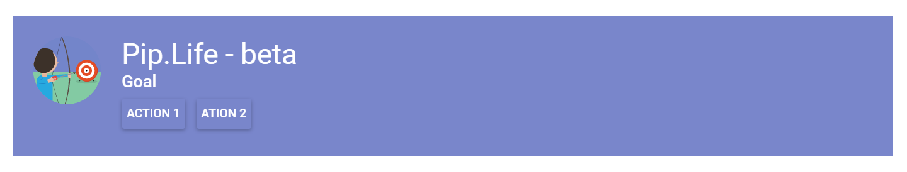
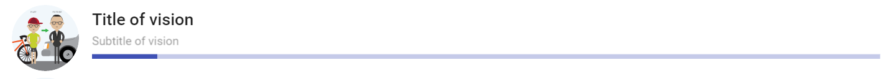
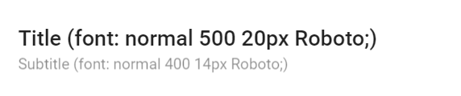
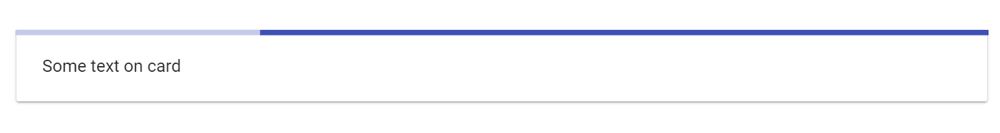
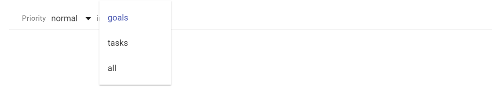

# Pip.WebUI.CSS User's Guide

## <a name="contents"></a> Contents
- [Installing](#install)
- [pip-ref-toolbar component](#ref_toolbar)
- [pip-ref-title component](#ref_title)
- [pip-ref-expander component](#ref_expander)
- [pip-details-title component](#details_title)
- [pip-divider-\* component](#dividers)
- [pip-progress-top component](#progress_top)
- [pip-empty component](#empty)
- [pip-filter-row component](#filter_row)
- [Questions and bugs](#issues)


## <a name="install"></a> Installing

Add dependency to **pip-webui** into your **bower.json** or **package.json** file depending what you use.
```javascript
"dependencies": {
  ...
  "pip-webui": "*"
  ...
}
```

Alternatively you can install **pip-webui** manually using **bower**:
```bash
bower install pip-webui
```

or install it using **npm**:
```bash
npm install pip-webui
```

Include **pip-webui** files into your web application.
```html
<link rel="stylesheet" href=".../pip-webui-lib.min.css"/>
<link rel="stylesheet" href=".../pip-webui.min.css"/>
...
<script src=".../pip-webui-lib.min.js"></script>
```

## <a name="ref_toolbar"></a> pip-ref-toolbar component

**pip-ref-toolbar** represents a toolbar with item reference and optional action buttons.

### Usage
```html
<md-toolbar class="pip-ref-toolbar md-hue-1 bm24">
    

    <div class="pip-content">
        <p class="pip-title">Efficiently target long-term high-impact resources after distinctive e-services.</p>

        <p class="pip-subtitle">Goal</p>

        <div class="pip-action">
            <md-button class="md-raised md-primary md-hue-1" ng-click="">Action 1</md-button>
            <md-button class="md-raised md-primary md-hue-1" ng-click="">Action 2</md-button>
        </div>
    </div>
</md-toolbar>
```



### CSS Classes
* **pip-pic-sm** - class for small picture
* **pip-pic** - class for pictures
* **pip-content** - class for general div 
* **pip-title** - class for title text
* **pip-subtitle** - class for subtitle text
* **pip-actions** - class for div with buttons

## <a name="ref_title"></a> pip-ref-title component

**pip-ref-title** is used as a header on the top of details page. It shows title, details and avatar.

### Usage
```html
<div class="pip-ref-title layout-row">
	

	<div class="flex layout-column layout-align-center-start pip-content">
		<p class="pip-title">Title of vision</p>
		<p class="pip-subtitle">Subtitle of vision</p>
		<md-progress-linear class="tm8"></md-progress-linear>
	</div>
</div>
```




### CSS Classes
* **pip-pic-sm** - class for small picture
* **pip-pic** - class for pictures
* **pip-content** - class for general div 
* **pip-title** - class for title text
* **pip-subtitle** - class for subtitle text

## <a name="ref_expander"></a> pip-ref-expander component

**pip-ref-expander** is a clickable elemement that looks similar to **pip-ref-item** but also allows to expand/collapse details.

### Usage
```html
<div class="pip-ref-expander layout-row layout-align-start-center">
    <md-button class="flex">
        <div class="layout-row layout-align-start-center">
            
            <div class="pip-content flex">
                <p class="pip-title">
                    <md-icon md-svg-icon="icons:forward-all"></md-icon>
                    {{item.name}}
                </p>
                <p class="pip-subtitle">
                    <md-icon md-svg-icon="icons:world"></md-icon>
                    <span>{{item.status1}}</span>
                </p>
            </div>
            <md-icon md-svg-icon="icons:triangle-down" class="pip-chevron"></md-icon>
        </div>
    </md-button>
</div>
```


### CSS Classes
* **pip-pic-sm** - class for small picture
* **pip-pic** - class for pictures
* **pip-content** - class for general div 
* **pip-title** - class for title text
* **pip-subtitle** - class for subtitle text

## <a name="details_title"></a> pip-details-title component

**pip-details-title** is a standard header for detail panels with title and optional subtitle

### Usage
```html
<div class="pip-details-title">
    <p class="pip-title">Title (font: normal 500 20px Roboto;)</p>
    <p class="pip-subtitle">Subtitle (font: normal 400 14px Roboto;)</p>
</div>
```



### CSS Classes
* **pip-title** - class for title text
* **pip-subtitle** - class for subtitle text

## <a name="dividers"></a> pip-divider-\* components

**pip-divider**-\* used to separate content in different places

### Usage
```html
<md-card>
    <div class="p24-flex">
        Some text on card
        <div class="pip-divider"></div>
        Some text on card
    </div>

</md-card>
```


### CSS Classes
* **pip-dividers** - standard divider with top and bottom margins 8рх
* **pip-tile-divider** - divider for tiles with top and bottom margins 8рх
* **pip-list-divider** -  divider for list with top and bottom margins 8рх

## <a name="progress_top"></a> pip-progress-top component

**progress-top** shows linear progress line at the top of a panel without "jumps" of internal content.

### Usage
```html
<md-card class="lm0">
    <div class="p24">
        <md-progress-linear class="pip-progress-top"> </md-progress-linear>

        Some text on card
    </div>

</md-card>
```


## <a name="empty"></a> pip-empty component

**pip-empty** component shows a placeholder for pages without data. It gives an explanation and provides one or few actions to get started.

### Usage
```html
<div class="pip-empty" >
        <div style="background-image: url('images/ES_Timeline.svg');" class="pip-pic" ></div>

        <div class="pip-text">
            Here you can plan the main events of the day and coordinate with your partners
        </div>
        <div class="pip-actions">
            <md-button class="md-accent">
                ADD EVENT
            </md-button>
            <md-button class="md-accent">
                ADD EVENT FROM CURRENT WEEK
            </md-button>
            <md-button class="md-accent">
                WORK ON GOALS
            </md-button>
        </div>

    </div>
```


### CSS Classes
* **pip-empty** - general class for pip-empty component
* **pip-text** - class for text 
* **pip-pic** - class for picture
* **pip-actions** - class for div with buttons

## <a name="filter_row"></a> pip-filter-row components

**pip-filter-row** is used to style filters on the top of a page or panel.

### Usage
```html
<div class="pip-filter-row divider-bottom layout-row layout-align-start-center">
    <div class="pip-filter-text">
       Priority
    </div>

    <md-input-container class="md-block">
        <md-select ng-disable="{{disableControls}}" class="flex"
                   aria-label="Status" ng-model="topicModel1">
            <md-option ng-value="opt" ng-repeat="opt in topic1">
                {{::opt}}
            </md-option>
        </md-select>
    </md-input-container>
</div>
```



### CSS Classes
* **pip-filter-text** - text in filter row

## <a name="issues"></a> Questions and bugs

If you have any questions regarding the module, you can ask them using our 
[discussion forum](https://groups.google.com/forum/#!forum/pip-webui).

Bugs related to this module can be reported using [github issues](https://github.com/pip-webui/pip-webui-headers/issues).
